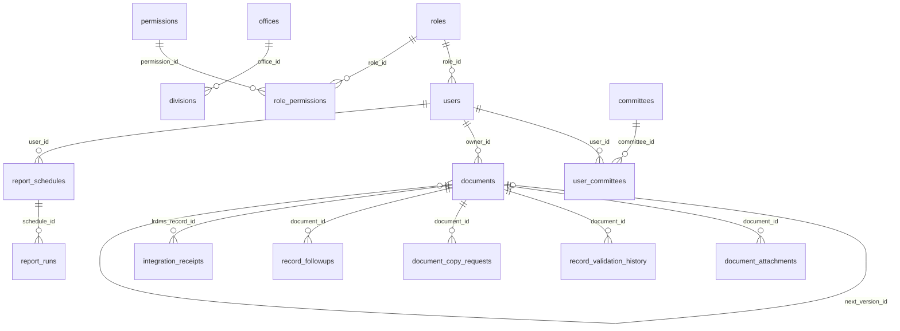

# Database architecture and normalization

This describes the local migrated LRDMS schema inspected on 2026-10-02: **38 InnoDB tables, 290 columns and 63 declared foreign-key constraints**. It is not proof that the deployed database has the same migrations. Schema-only artifacts contain no account passwords, emails, document rows or production credentials.

See the [complete data dictionary](database-data-dictionary.md), [machine-readable schema](database-schema.json), [full Mermaid ER diagram](database-erd.mmd) and [measured query plans](database-performance.md).

## Core relationships



The diagram above is intentionally a readable subset. The full generated diagram includes every table and declared relationship; it uses column nullability and single-column unique keys to distinguish optional parents and one-to-one child records (for example, user_profile_photos is keyed by user_id). Read it alongside the dictionary for composite-key details.

## Normalization rationale

The design generally separates entities, reference lists and repeatable events rather than storing comma-separated relationships:

- **First normal form:** record metadata uses individual typed columns; multiple attachments, review events, copy requests and follow-ups are separate rows. Roles/permissions and user/committee assignments use junction tables.
- **Second normal form:** composite-key junction tables represent a relationship between their complete pair of keys. Descriptive role, permission and committee data stays in the referenced tables instead of being repeated in each assignment.
- **Third normal form as a design target:** account identity, organizational lists, roles, record files and event histories are separated. Record events reference a document and actor rather than duplicating the entire record/account. This is a rationale, not a formal proof that every table is fully in 3NF or BCNF.

Intentional or legacy exceptions require explanation:

| Area | Reason / limitation |
|---|---|
| `audit_log.username_snapshot` and request contact snapshots | Preserve the historical identity/contact at the time of an event, even if the account changes later. |
| Document source-system/status/office/division labels | Preserve externally supplied provenance. These are textual source snapshots, not asserted local organizational foreign keys. |
| `users.office_id` with `division_id` | Redundant hierarchy information supports existing access rules. Each reference is constrained individually, but the database does not enforce that the chosen division belongs to the chosen office. Application validation and a hierarchy audit remain necessary. |
| `previous_version_id` and `next_version_id` | Bidirectional links aid navigation. Foreign keys now reject missing targets, but do not prove reciprocity, acyclicity or a single revision head; the existing workflow enforces those business rules. |
| OCR files, saved search criteria and report options/snapshots stored as JSON/text | Bounded operational configurations or historical payloads. They are not a substitute for relational document/user ownership. Application validation defines their internal shape. |
| Profile-photo and generated-PDF binary fields | Stored separately from account metadata or schedule definitions. These enlarge logical backups and are copied byte-for-byte by the backup tool. |
| `ocr_jobs.requested_by` | Legacy actor reference without a declared foreign key. It is disclosed in the dictionary; the 63-constraint orphan audit does not certify undeclared relationships. |
| `documents.doc_number` | Indexed business reference, not a globally unique SQL constraint. Existing application duplicate checks do not establish a global concurrent-ingest uniqueness guarantee. |

## Integrity and indexes

The local read-only orphan audit found **zero orphan rows across all 63 declared constraints** after migration. The Section 6 migration adds restrictive self-referencing foreign keys for both version-link columns, after checking existing targets. If an existing orphan is found on deployment, migration stops and reports the problem; it never deletes or silently changes records.

Seven additional nonunique indexes support document-number lookup, document creation-date reports, the intake queue, audit date/module exports and global/own search history. Existing covering prefixes are detected to keep migration idempotent. No unique document-number constraint is imposed and no existing index is dropped.

Measured behavior is in [database-performance.md](database-performance.md). The synthetic comparison preserves exact results and uses deterministic ID tie-breakers. Index choices should be reviewed with representative production data and write rates; an optimizer may choose a table scan when that is cheaper.

## Reproducible inspection

```powershell
php database/inspect_database.php | Set-Content -Encoding utf8 .runtime/schema-metadata.json
php database/inspect_database.php --integrity
python database/generate_data_dictionary.py .runtime/schema-metadata.json
```

The inspector reads information_schema and, for `--integrity`, counts unmatched FK references without printing row contents. The dictionary generator requires descriptions for every discovered table/column; an unknown field fails generation rather than silently producing an incomplete dictionary. Python is only a development documentation tool, not an application runtime dependency.

Run inspection against the live database separately before panel evaluation. Do not publish a production data dump as schema evidence.
